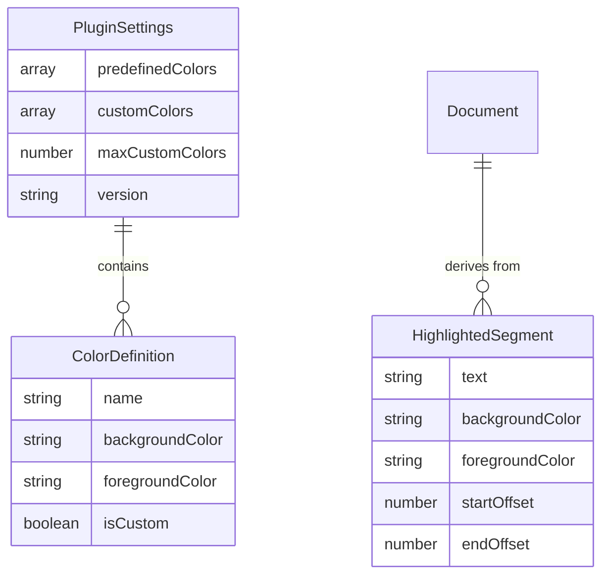

# Data Model: Text Highlighter for Obsidian

**Feature**: Text Highlighter Plugin
**Date**: 2025-09-18
**Version**: 1.0.0

## Overview
This document defines the data structures and relationships for the Obsidian text highlighter plugin. The model is designed to be simple, focusing on color definitions and plugin settings persistence.

## Entity Definitions

### 1. ColorDefinition

**Purpose**: Represents a single highlight color option available to users with both background and optional foreground colors

**Fields**:
| Field | Type | Required | Description | Validation |
|-------|------|----------|-------------|------------|
| name | string | Yes | Display name for the color | 1-20 characters, alphanumeric + spaces |
| backgroundColor | string | Yes | CSS background color value | Valid CSS color (hex, rgb, or name) |
| foregroundColor | string | No | CSS text color value | Valid CSS color or null/undefined |
| isCustom | boolean | Yes | Whether user-defined or predefined | - |

**Example**:
```typescript
// With both colors
{
  name: "Yellow",
  backgroundColor: "#FFFF00",
  foregroundColor: "#000000",
  isCustom: false
}

// Background only
{
  name: "Light Blue",
  backgroundColor: "#ADD8E6",
  foregroundColor: null,
  isCustom: true
}
```

### 2. PluginSettings

**Purpose**: Persisted configuration for the plugin

**Fields**:
| Field | Type | Required | Description | Validation |
|-------|------|----------|-------------|------------|
| predefinedColors | ColorDefinition[] | Yes | Built-in color options | Exactly 3 items |
| customColors | ColorDefinition[] | Yes | User-defined colors | 0-10 items |
| maxCustomColors | number | Yes | Maximum custom colors allowed | Fixed at 10 |
| version | string | Yes | Settings schema version | Semantic version |

**Example**:
```typescript
{
  predefinedColors: [
    { name: "Red", backgroundColor: "red", foregroundColor: "white", isCustom: false },
    { name: "Yellow", backgroundColor: "yellow", foregroundColor: "black", isCustom: false },
    { name: "Light Green", backgroundColor: "lightgreen", foregroundColor: null, isCustom: false }
  ],
  customColors: [
    { name: "Ocean Blue", backgroundColor: "#006994", foregroundColor: "#FFFFFF", isCustom: true }
  ],
  maxCustomColors: 10,
  version: "1.0.0"
}
```

### 3. HighlightedSegment (Runtime Only)

**Purpose**: Represents a text segment with highlighting (not persisted, derived from document content)

**Fields**:
| Field | Type | Required | Description | Validation |
|-------|------|----------|-------------|------------|
| text | string | Yes | The highlighted text content | Non-empty |
| backgroundColor | string | Yes | Applied background color | Valid CSS color |
| foregroundColor | string | No | Applied text color | Valid CSS color or null |
| startOffset | number | Yes | Start position in document | >= 0 |
| endOffset | number | Yes | End position in document | > startOffset |

**Note**: This entity is computed at runtime by parsing HTML span tags in the document. It is never stored separately.

## Relationships



## State Transitions

### ColorDefinition States
1. **Created**: User adds new custom color
2. **Updated**: User modifies existing custom color
3. **Deleted**: User removes custom color
4. **Applied**: Color used to highlight text
5. **Inactive**: Color exists but not currently applied

### HighlightedSegment States
1. **Created**: User applies highlight to text
2. **Detected**: Plugin finds existing highlight in document
3. **Expanded**: Selection expanded to full highlight
4. **Removed**: User erases highlight

## Validation Rules

### ColorDefinition Validation
- `name`: Required, 1-20 characters, no special characters except spaces
- `backgroundColor`: Required, must be valid CSS color format
  - Hex: `#RGB` or `#RRGGBB`
  - RGB: `rgb(r, g, b)` or `rgba(r, g, b, a)`
  - Named: Valid CSS color name
- `foregroundColor`: Optional, if provided must be valid CSS color format
  - Same formats as backgroundColor
  - Can be null or undefined
- `isCustom`: Must be `false` for predefined, `true` for user-defined

### PluginSettings Validation
- `predefinedColors`: Exactly 3 items, all with `isCustom: false`
- `customColors`: 0-10 items, all with `isCustom: true`
- `maxCustomColors`: Must equal 10
- No duplicate color names across predefined and custom
- `version`: Valid semantic version string

### HighlightedSegment Validation
- `text`: Non-empty string
- `backgroundColor`: Valid CSS color that exists in settings
- `foregroundColor`: Valid CSS color or null
- `startOffset`: Non-negative integer
- `endOffset`: Greater than startOffset
- No overlapping segments (enforced by business logic)

## Storage Format

Settings are stored in JSON format at:
```
.obsidian/plugins/obsidian-highlighter/data.json
```

Example file content:
```json
{
  "predefinedColors": [
    {"name": "Red", "backgroundColor": "red", "foregroundColor": "white", "isCustom": false},
    {"name": "Yellow", "backgroundColor": "yellow", "foregroundColor": "black", "isCustom": false},
    {"name": "Light Green", "backgroundColor": "lightgreen", "foregroundColor": null, "isCustom": false}
  ],
  "customColors": [
    {"name": "Ocean Blue", "backgroundColor": "#006994", "foregroundColor": "#FFFFFF", "isCustom": true},
    {"name": "Sunset Orange", "backgroundColor": "#ff6b35", "foregroundColor": null, "isCustom": true}
  ],
  "maxCustomColors": 10,
  "version": "1.0.0"
}
```

## Migration Strategy

For future schema changes:
1. Check `version` field on load
2. If older version, apply migrations in sequence
3. Update version field after successful migration
4. Backup original settings before migration

## Performance Considerations

1. **Settings Caching**: Load once on plugin start, keep in memory
2. **Highlight Detection**: Use compiled regex, cache results per document
3. **Menu Generation**: Build menu items dynamically, don't pre-generate
4. **Color Validation**: Validate on input, not on every use

## Security Considerations

1. **Color Sanitization**: Validate all color inputs to prevent CSS injection
2. **Name Sanitization**: Strip HTML/script tags from color names
3. **File Access**: Only write to designated plugin directory
4. **No Remote Data**: All data stored locally in vault